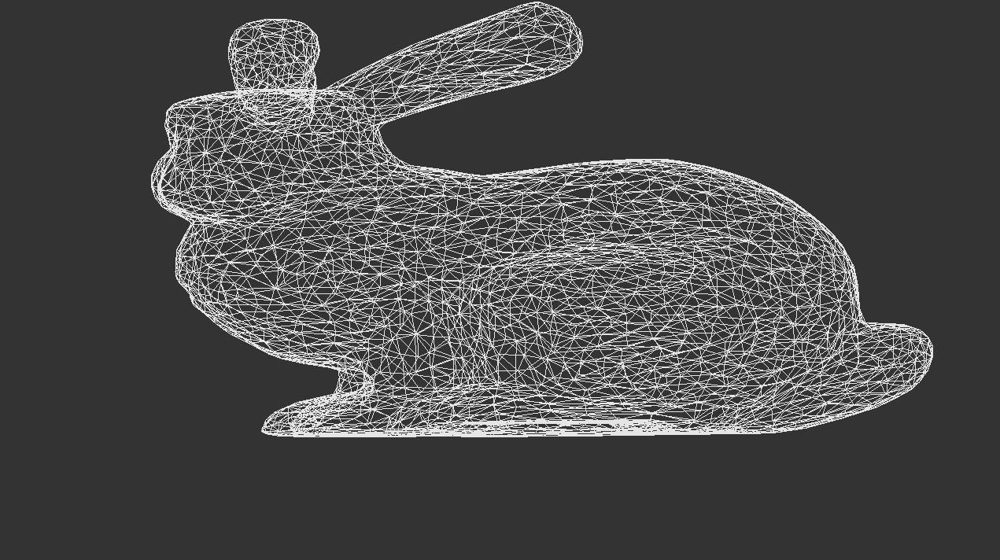
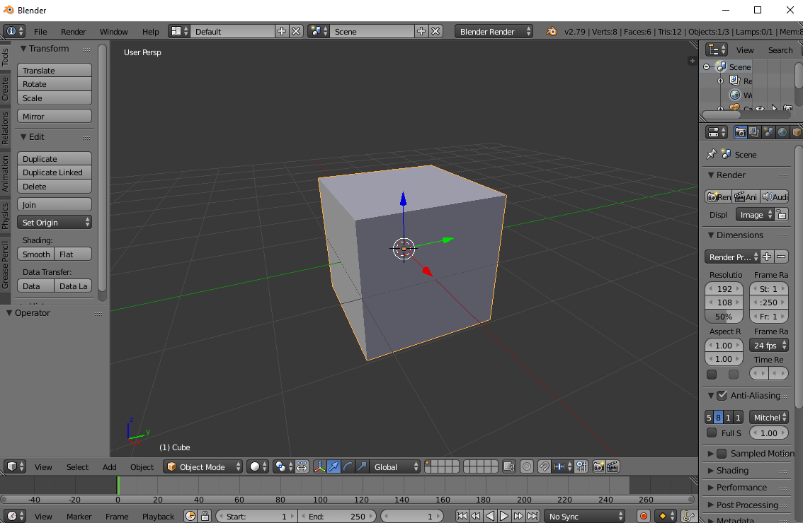

# Assignment 3 - Render a .obj model



*TODO*: Please edit the following information in your assignment

* Name and partners name(At most 1 partner for this Assignment): 
* How many hours did it take you to complete this Assignment? 
* Did you collaborate or share ideas with any other students/TAs/Professors? 
* Did you use any external resources? 
  * (tbd if any)
  * (tbd if any)
  * (tbd if any)
* (Optional) What was the most interesting part of the assignment? How would you improve this assignment?
  
## Description

You have learned that we can draw polygons to the screen by plotting them out one triangle at a time both in a software render and in OpenGL. We can even use mathematical functions to draw nice curves and geometric patterns (e.g. the [sierpinski triangle](https://en.wikipedia.org/wiki/Sierpi%C5%84ski_triangle)) to draw more interesting graphical scenes.  Most often however complex shapes will either be modeled in 3D by artists [[1](https://www.youtube.com/watch?v=SaPkbl5n7Pc)] [[2](https://www.youtube.com/watch?v=funtOiN3gKY)] or otherwise scanned from the real world by [lasers to capture the geometry](https://www.youtube.com/watch?v=1lDO1UevAJI) of an object. This data is then output in a 3D file format that can be read in by the CPU and then drawn to the screen using our GPUs.

## Part 1 - The vector data structure (C++ refresh)

I want to give a little bit more background on a helpful data structure for this assignment. The Standard Template Library(STL) provides [std::vector](http://www.cplusplus.com/reference/vector/vector/). It is an exapanding data structure that we can push data into, and access each element read from in O(1) time. Provided below is an example for working with a std::vector and a custom data type.

```cpp
// This is a 'toy' example of using the std::vector
// Compile with:
// g++ vector.cpp -o vector

#include <iostream>
#include <vector>	// Our new library

// Here is a struct that holds
// the indicies that make up a triangle.
// Note that we are using a 'struct' as a 
// 'Plain-old datatype' or POD, to just hold
// some information. No fancy constructors or
// destructors needed since we are only 
// storing primitive data types in each field.
struct Triangle{
    unsigned int i1,i2,i3;
};

// Here is a vector that holds all of the indicies.
// Since we are creating it outside of our main,
// it is a global variable and allocated on the heap memory.
// NOTE: This is a toy example--but I want you to pay attention
// that this is allcoated in the 'heap' or otherwise some other
// globally accessible form of memory.
std::vector<unsigned int> indiciesList;

// Entry function into our C++ program.
int main(){

    // This local variable triangleList holds all of the triangles
    // for our model. We are allocating it on the stack here.
    // Remember, things allocated on the stack are 'deleted' 
    // when we exit the function from which they were allocated
    // (in this case, the main() function).
    std::vector<Triangle> triangleList;

    // We create a first traingle. It will be made up of
    // whatever 'vertex' 0, 1, and 2 are. 
    Triangle t;
    t.i1=0;
    t.i2=1;
    t.i3=2;
	
    // Here is a second triangle. This time it is made up
    // of wherever triangle 2, 1, and 3 are.
    Triangle t1;
    t1.i1=2;
    t1.i2=1;
    t1.i3=3;
    
    // And a third triangle...
    Triangle t2;
    t2.i1=2;
    t2.i2=1;
    t2.i3=3;

    // We now 'append' each of our traingles to our triangle list.
    triangleList.push_back(t);
    triangleList.push_back(t1);
    triangleList.push_back(t2);


    // We can print out some information about each of our vectors.
    // This tells us how many triangles we have.
    std::cout << "triangleList.size():" << triangleList.size() << "\n";
    // Here is another example.
    // Careful, this tells us the size of a data type.
    // Do you understand what triangList.data() is giving us access to? Look it up!
    std::cout << "sizeof(triangleList.data()):" << sizeof(triangleList.data()) << "\n";
    // Here we print out the size of each 'data type' NOT how much data we have
    // stored within them.
    std::cout << "sizeof(triangleList):" << sizeof(triangleList) << "\n";
    std::cout << "sizeof(Triangle):" << sizeof(Triangle) << "\n";

    // Here is an array with 12 elements, each element that is 4 bytes.
    // I am also allocating it on the stack, which costs me 48 bytes.
    unsigned int indicies[] = {0,1,2, 0,3,4, 7,8,9,10,11,12};

    // Let's also add to our 'global indiciesList' some things.
    // Remember, indiciesList is on the heap.
    indiciesList.push_back(0);
    indiciesList.push_back(1);
    indiciesList.push_back(2);
    indiciesList.push_back(0);
    indiciesList.push_back(3);

    // Arrays allocated on the stack will tell me exactly how big the structure is.
    // That is because the sizeof operator has the exact information needed available
    // to compute the size.
    std::cout << "sizeof(indicies) on stack:" << sizeof(indicies) << "\n";
    // sizeof here only tells me the size of a 'std::vector' type. Be careful!
    std::cout << "sizeof(indiciesList)     :" << sizeof(indiciesList) << "\n";

    return 0;
}
```

**Why is the above example important?** 

For two reasons:

1. [std::vector](http://www.cplusplus.com/reference/vector/vector/) is a nice data structure to assist in implementing your model loader (see next task)
2. I often have seen students make a mistake when figuring out how much memory to allocate on the GPU end (i.e. when you start using [glBufferData](http://docs.gl/gl3/glBufferData)). I hope the above example at least provides the insight that it is worth printing out how much memory you have allocated.
3. Many common libraries are structured similarly to the STL set.  For example, the Qt data structure, QVector shares most of the public API (and extends it nicely).

## Part 1 - Render a model

### Task 1 - Model loading

For this assignment you are going to render a 3D model in the [wavefront .obj format](https://en.wikipedia.org/wiki/Wavefront_.obj_file).

The tasks for rendering in this assignment are the following:
1. Make sure you can parse the .obj file format (i.e. read in the vertices and faces). This is your geometry data.
2. Make sure you can store the geoemtry data.
3. Make sure you know how to work with vertex buffers.
 	- You will also be using an index buffer in order to be more efficient in loading the .obj file.
 	- Here is a resource motivating index buffers: [vbo-indexing](http://www.opengl-tutorial.org/intermediate-tutorials/tutorial-9-vbo-indexing/])

### OBJ Format

The models that you will be loading are in the .obj format. This format stores the vertices, normals, and faces of an object (and potentially other information as well). The easiest way to become familiar with the OBJ file format is to investigate a 3D Cube model. Here is a cube exported in the .obj file foramt from the free tool [Blender3D](https://www.blender.org/).



### Parsing the file

(For this assignment, ignore the .mtl materials files)
```
mtllib cube.mtl
o Cube1
#8 vertices, 12 faces
v -1.00000000 -1.00000000 -1.00000000
v -1.00000000 -1.00000000 1.00000000
v -1.00000000 1.00000000 -1.00000000
v -1.00000000 1.00000000 1.00000000
v 1.00000000 -1.00000000 -1.00000000
v 1.00000000 -1.00000000 1.00000000
v 1.00000000 1.00000000 -1.00000000
v 1.00000000 1.00000000 1.00000000
vn -0.57735027 -0.57735027 -0.57735027
vn -0.57735027 -0.57735027 0.57735027
vn -0.57735027 0.57735027 -0.57735027
vn -0.57735027 0.57735027 0.57735027
vn 0.57735027 -0.57735027 -0.57735027
vn 0.57735027 -0.57735027 0.57735027
vn 0.57735027 0.57735027 -0.57735027
vn 0.57735027 0.57735027 0.57735027
g Cube1_default
usemtl default
s 1
f 1//1 5//5 2//2
f 2//2 3//3 1//1
f 2//2 5//5 6//6
f 2//2 8//8 4//4
f 3//3 5//5 1//1
f 3//3 8//8 7//7
f 4//4 3//3 2//2
f 4//4 8//8 3//3
f 5//5 8//8 6//6
f 6//6 8//8 2//2
f 7//7 5//5 3//3
f 7//7 8//8 5//5
```

For this file, the encoding is the following:
* Lines that start with *v* stands for a 'vertex'.
	* A vertex has an x,y,z coordinate that follows.
* Lines that start with *vn* stands for a 'vertex normal'.
	* A vertex normal is a normalized directional vector(from 0,0,0 to its location)
* Lines that start with *f* stands for 'face'.
	* A face can consist of any number of vertices. 
	* The first number is the index of the vertex we are using. 
	* The second number after the double slashes (//) is the vertex normal index.
* The other fields (that start with o, s, or the .mtl file) can be ignored for this assignment.
* Note that there are no '0' values in the list. This means .obj is 1's based. In most languages we count from 0, so think about what this means when parsing!

### Task 2 - Interactive graphics

For task 2, we are going to utilize Qt to make our graphics application interactive. 

The tasks for interactivity in this assignment are the following:
- Pressing the 'w' key draws your object in wireframe mode.
- Pressing the 'q' key exits the application.
- Pressing the '1' key renders a bunny (which is shown default)
- Pressing the '2' key renders a monkey


### Assignment strategy

My suggested strategy for this project is:

* You can use any of the code from the labs that you may find useful.
	* In fact, I highly recommend it!
* Have a special C++ class (in a .h and .cpp file) for loading OBJ models--not doing so is bad style!
	* Utilize any data structure you like in the STL, OR in Qt (e.g. std::vector or QVector)
  	* You may assume all faces are triangles (though if you download additional test .obj files from the web this may not be the case)
* Think about how you can load a line of text and then split it into individual tokens.
  	* A resource loading files (Filo I/O) in C++ can be found here: http://www.cplusplus.com/doc/tutorial/files/
	* Feel free to use the utilities provided by Qt - This can make your life potentially easier!
  	* The reference on strings may be useful: http://www.cplusplus.com/reference/string/string/
    		* Some ideas on string splitting: http://www.martinbroadhurst.com/how-to-split-a-string-in-c.html
* You do not need to use any complex shaders. In fact, I recommend using the most basic ones for this assignment.
* I recommend using the [docs.gl](http://docs.gl/gl3/glPolygonMode) webpage for help with OpenGL. 
* Note, that we do not yet have a camera, so you may be inside the object--consider that when you are rendering (in the case of the cube for example, you will see an 'X' in your display).

## How to run your program

Your solution should compile using the CMake build process.

## Deliverables

- You should be able to load and display a bunny.obj and monkey.obj 
	- The ./objects directory in your repository has some sample models.
	- You can substitute these models with other .obj's you find if you like.
- Your solution should be interactive, and utilize the w,q,1,2 keys as described in Part 1 Task 2

* You need to commit your code to this repository.
* You need to use the build.py script provided. Anything else used is at your own risk--and you should provide complete documentation. If your program does not compile and run, you get a zero!

## Rubric

<table>
  <tbody>
    <tr>
      <th>Points</th>
      <th align="center">Description</th>
    </tr>
    <tr>
      <td>30% (Core)</td>
      <td align="left"><ul><li>Is the code clearly documented?</li><li>Are there no memory leaks?</li><li>Did you close the file after opening it?</li><li>How well was your abstraction to create a loader (or was it one giant ugly main function)?</li><li>Did you make sure your code worked with the 'build.py' or did we have a headache compiling your code?</li></ul></td>
    </tr>   
    <tr>
      <td>40% (Core)</td>
      <td align="left"><ul><li>(15%) At the very least, does the cube render?</li><li>(15%) Are you off by one for rendering vertices?</li><li>(10%) Did you create only two buffers for your objects? (Creating them over and over is wrong!)</li></ul></td>
    </tr>
    <tr>
      <td>20% (Intermediate)</td>
      <td align="left"><ul><li>(5%) Can you render the bunny(by pressing the '1' key) and the monkey .obj provided(by pressing the '2' key)?</li><li>(5%) Did you use the index buffering strategy?</li><li>(5%) Can I render the objects filled and in wireframe by pressing the 'w' key.</li><li>(5%) Does the 'q' key exit the program.</li></ul></td>
    </tr>
    <tr>
      <td>10% (Advanced)</td>
      <td align="left"><ul><li>(5%) Can I render a really large .obj model (> 10,000 triangles)?</li><li>(5%) If I load an .obj file that includes texture coordinates, does your loader crash?</li></ul> </td>
    </tr>
  </tbody>
</table>

* Core is the material everyone can get through. I expect everyone to complete this. Coming to class, listening to lectures, and reviewing materials should be sufficient.
* Intermediate is a little more difficult. Very likely you will have to utilize office hours, piazza, etc.
* Advanced is more challenging. You will have to spend more time and very likely use outside materials. I do not expect everyone to complete the advanced section.

## More Resources

* Help with OBJ Model Format
	* [Briefing on the .obj format](https://people.cs.clemson.edu/~dhouse/courses/405/docs/brief-obj-file-format.html) (I recommend reading this one for more information)
	* [Another nice writeup on .obj format](https://www.cs.cmu.edu/~mbz/personal/graphics/obj.html)
	* [wiki page on wavfront .obj format](https://en.wikipedia.org/wiki/Wavefront_.obj_file)

## F.A.Q

* Q: Why the obj format?
  * A: It is a standard data format understood by most programs.
* Q: Can I load my own models that I have made to show off?
  * A: Sure -- just make sure they are added to the repository.
* Q: May I use the command line arguments to pass in a default model?
  * A: Sure -- please document at the top of your readme.md file so I am aware of this feature.
