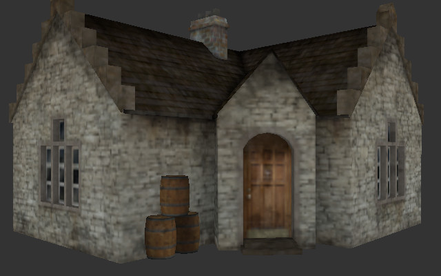

# Assignment 4 - Render a Textured .obj model

(The picture shows an example of success for this assignment)



*TODO*: Please edit the following information in your assignment

* Name and partners name(At most 1 partner for this Assignment): 
* How many hours did it take you to complete this Assignment? 
* Did you collaborate or share ideas with any other students/TAs/Professors? 
* Did you use any external resources? 
  * (tbd if any)
  * (tbd if any)
  * (tbd if any)
* (Optional) What was the most interesting part of the assignment? How would you improve this assignment?
  
## Description

Previously we have drawn a solid filled color and a wireframe for a
.obj model. We were able to parse the .obj file format, picking out
the vertices, and then make triangles based on selecting the right
vertices(our indices). One optimization we made use of was OpenGl's
index buffer which allowed us to *pick* the vertex data that we need
to make a triangle. A final call to
[glDrawElements](http://docs.gl/gl3/glDrawElements) was finally used
to render the model to the screen for the amount of indices we had
(which was some multiple of 3).

For this assignment we are going to add more detail to our loader by
adding texture onto our model. In our scene, we will also add a
perspective camera transformation so we can more properly convey depth
in our 3D graphics scene. By the end of this assignment you will have
made use of what you learned in assignment 1 (PPM Loader) and 2 (.obj
loader).

### Assignment Strategy

This assignment requires some amount of thinking. The actual amount of
lines of code is potentially small (ballpark of 100 or less) if you
are building this assignment from our previous labs (e.g. lab 7). Here
are my recommendations:

1. Make use (or study) of lab 7 as starter code that supports vertex and texture data.
2. Only after you get things working: take this as an opportunity to clean up your codebase.

## Part 1 - Object-Oriented Programming Strategies (C++ refresh)

I want to continue to give a little bit more background on C++ and
thinking about data. There is no deliverable for part 1, but it will
be useful to at the very least think about.

### Task 1 - Program arguments

In order to speed up iteration time, it can be useful to read in a
data from program arguments. This can be done via the argc/argv
parameter in main.cpp.  Another option is to use the Qt-based File->Open
mechanism.  This is easy to implement and can often be easier to deal with
than commandline args.

```cpp
#include <iostream>

int main(int argc, char** argv){

    std::cout << "My argument is: " << argv[1] << "\n";

    return 0;
}
```

### Task 2 - Structs

structs in C++ while functionally the same as a class (except for the
default access modifier level) are typically used as plain old
datatypes--i.e. a way to create a composite data type.

Shown below is an example of a struct in C++
```cpp

struct VertexData{
	float x,y,z;
	float s,t;
};

``` It is further important to note the order of our variables in the
VertexData struct. In memory, they will be arranged as x,y,z,s,t in
that order. This is potentially convenient as in our current buffer
data strategy we have been laying out values of the first vertices
x,y,z,s,t,etc. in a specific order defined by our vertex layout.

It may further be useful to add a constructor to our struct for
convenience.

```cpp

struct VertexData{
	float x,y,z;
	float s,t;

	VertexData(float _x, float _y, float _z, float _s, float _t): x(_x),y(_y),z(_z),s(_s),t(_t) { }
};

```

Often with structs, because they are a datatype, it can be helpful to
define mathematical operators with them. Below a test showing how to
test for equality is done.

```cpp

struct VertexData{
	float x,y,z;
	float s,t;

	VertexData(float _x, float _y, float _z, float _s, float _t): x(_x),y(_y),z(_z),s(_s),t(_t) { }
	
	// Tests if two VertexData are equal
	bool operator== (const VertexData &rhs){
		if( (x == rhs.x) && (y == rhs.y) && (z == rhs.z) && (s == rhs.s) && (t == rhs.t) ){
			return true;
		}
		return false;
	}
};

```

In our previous lab, we passed references to vectors of data for this purpose.  Is this way better?

More information on structs can be found here: 
- http://www.cplusplus.com/doc/tutorial/structures/
- https://www.learncpp.com/cpp-tutorial/47-structs/

## Part 2 - Rendering a Textured Model

### Task 1 - .obj and Texture Coordinates 


For this assignment you are going to render a single textured 3D
model. Several are provided in the 'objects' folder. I have personally
tested with the 'house' model for most of my iterations, so I
recommend you do the same.

The tasks for rendering in this assignment are the following:
1. Make sure you can parse the .obj file format and associated material file. 
	- read in the vertex (v), vertex texture (vt) and face(f) information.
2. The .obj file should be read in from the command line arguments
	- e.g. `./lab "./objects/capsule/capsule.obj"`

### OBJ Format -- continued

The models that you will be loading are in the .obj format. This
format stores the vertices, texture coordinates, normals, and faces of
an object (and potentially other information as well). One way to
become familiar with the OBJ file format is to investigate a simple
model by opening it in a text editor. Below is a capsule in the .obj
file format that was exported from the free tool
[Blender3D](https://www.blender.org/). It may also be worth exploring
models in 3D modeling and animation tools like Blender3D as well.


### Parsing Texture Coordinates and the Material Files(.mtl)

For this assignment, now we will also make use of the .mtl file that
is also generated with .obj files. Let's first take a look at one of
the provided .obj files "windmill"

### Windmill .obj

What you will notice below, is that the file looks largely the same. However, there are a few new changes we want to pay attention to.

1. There is something called a **mtllib** that specifies which file to use to find material information.
	- In our case, it is in a file called windmill.mtl that will be described in the next section.
2. There are **vt** listings for vertex coordinates that folow the long list of (**v**) vertex listings.
3. There are now vertex texture coordinates for each face that we want to handle.
	- i.e. A face needs a vertex, vertex texture, and vertex normal index.
	- (We are still ignoring normals at this point)
	- Note that the order they are listed in the file, v's followed by vt's followed by vn's means a face is a series of f v/vt/vn v/vt/vn v/vt/vn.
	
```
# Blender v2.79 (sub 0) OBJ File: ''
# www.blender.org
mtllib windmill.mtl
o WindMill
v -0.553154 1.064796 -0.746740
v -0.553154 1.064796 0.653572
v -0.555058 2.789091 0.648866
v -0.555058 2.789091 -0.742033
# More vertices ..
vt 0.579430 0.005116
vt 0.786357 0.005169
vt 0.785661 0.284613
vt 0.579768 0.284582
vt 0.100437 0.383934
vt 0.009483 0.283401
# ... more data continued
f 1/1/1 2/2/1 3/3/1 4/4/1
f 5/5/2 3/6/2 6/7/2
f 6/7/3 7/8/3 8/9/3 9/10/3
f 10/11/4 11/12/4 12/13/4 13/14/4
f 14/15/5 15/16/5 16/17/5 17/18/5
# ... yet more data continued
```

### Windmill Material File

```
# Blender MTL File: 'None'
# Material Count: 1

newmtl blinn1SG
Ns 0.000000
Ka 0.100000 0.100000 0.100000
Kd 0.000000 0.000000 0.000000
Ks 0.000000 0.000000 0.000000
Ke 0.000000 0.000000 0.000000
Ni 1.500000
d 1.000000
illum 2
map_Kd windmill_diffuse.ppm
map_Bump windmill_normal.ppm
map_Ks windmill_spec.ppm
```

The windmill material(.mtl) file contains some additional data. The
first line specifies what the material name is ("blinn1SG"). This is
the line that will be referred to within the .obj file. The most
important piece of information otherwise is the 'map_Kd' which says
where the 'diffuse color' map file is. This is the image where we
sample colors from and apply them to triangles.

**You may assume one texture per model for this assignment**

A few of the additional fields are specified in [Paul Burke's
guide](http://paulbourke.net/dataformats/obj/minobj.html), which are
primarily used for rendering a scene. For now, we are only interested
in the color.

### Something fishy about our index buffer strategy

`f 5/5/2 3/6/2 6/7/2`

Taking a closer look at one of the lines, I notice that all of the
numbers are not the same. `3/6/2` for instance, is not nicely packed
together with the same vertex, vertex texture, and vertex normal. So
how does this work with our previous index buffer strategy?

http://www.opengl-tutorial.org/intermediate-tutorials/tutorial-9-vbo-indexing/ provides a nice little algorithm I have referenced below: 

> For each input vertex
>
> &nbsp;&nbsp;Try to find a similar ( = same for all attributes ) vertex between all those we already output
>
> &nbsp;&nbsp;&nbsp;&nbsp;If found :
>
> &nbsp;&nbsp;&nbsp;&nbsp;&nbsp;&nbsp;&nbsp;&nbsp; A similar vertex is already in the VBO, use it instead !
>
> &nbsp;&nbsp;&nbsp;&nbsp;If not found :
>
> &nbsp;&nbsp;&nbsp;&nbsp;&nbsp;&nbsp;&nbsp;&nbsp;No similar vertex found, add it to the VBO

I will provide my explanation of the algorithm, but you will need to think about why this makes sense.

1. Let us take these values `5/5/2`, `3/6/2`, and `6/7/2`
	- The first one `5/5/2` needs the 5th vertex (remember the format v/vt/vn). That means lookup in some data structure, our fifth vertex (a set of x,y,z).
	- We then repeat this process and pick up the fifth texture data, a pair of (s,t) values.
	- ( For this assignment, we can ignore the vertex normal)
2. We can then think of the tuple(5,5,2) as x5,y5,z5,s5,t5. It is a set of unique values, and they may be repeated.
3. This would be different than the tuple (5,6,2) for instance, which is the five floating point numbers numbers x5,y5,z5,s6,t6.
4. So in my vertex buffer data between (5,5,2) and (5,6,2) I have the following data all packed together:
	- x5,y5,z5,s5,t5,x5,y5,z5,s6,t6
	- My 0th index in my index buffer would pull out the values: x5,y5,z5,s5,t5
	- My 1st index in my index buffer would pull out the values: x5,y5,z5,s6,t6
5. Reason about this and think before jumping straight into code.
6. Also understand you can print out the values and compare them with what you see in the actual .obj file (open up the .obj in a text editor).

### Loading your own models for this assignment

It is totally fine to provide your own school appropriate Textured 3D
.obj files for this assignment. Some notes that may save you time
debugging:

- Make sure you push the model, texture(s), and material file to the repository.

- If you use blender3D to export your own .obj model, make sure to
  scale it to about the size of a unit cube in Blender3D. This will
  save you time from moving the camera around a lot.

- Triangulate the faces within the blender3D (there is an option when you export)

- Check your material file to make sure it is loading .ppm images
  which we know how to handle. Use a program like
  [GIMP](https://www.gimp.org/) to convert them to ASCII format .ppm
  images otherwise.

- The .ppm image may be 'mirrored', meaning you have to flip it
  horizontally for the actual texture coordinates to line up with the
  appropriate vertices.

### Task 2 - Interactive Graphics

The tasks for interactivity in this assignment are the following:
- Pressing the 'w' key toggles drawing your scene in wireframe mode or textured polygon mode.
- Pressing the 'q' key exits the application.

### Task 3 - Perspective Camera

Make sure your scene is being rendered in perspective. Make
modifications to the vert.glsl as needed. This should be similar to
what you have done in a previous lab.

### More Assignment strategy 

My suggested strategy for this project is:

* You can use any of the code from the labs or previous assignments that you may find useful.
	* In fact, I highly recommend it!
* Have a special C++ class(in a .h and .cpp file) for loading OBJ models--not doing so is bad style!
	* Utilize any data structure you like in the STL (e.g. std::vector)
  	* You may assume all faces are triangles (though if you download any test .obj files from the web that may not be the case)
* Think about how you can load a line of text and then split it into individual tokens.
  	* A resource loading files (Filo I/O) in C++ can be found here: http://www.cplusplus.com/doc/tutorial/files/
  	* The reference on strings may be useful: http://www.cplusplus.com/reference/string/string/
    		* Some ideas on string splitting: http://www.martinbroadhurst.com/how-to-split-a-string-in-c.html
* You do not need to use any complex shaders. In fact, I recommend using the most basic ones for this assignment.
* I recommend using this webpage for help with OpenGL: http://docs.gl/gl3/glPolygonMode

## How to run your program

Your solution should compile using the CMakeLists.txt type build system we have been using all class.

Your program should then run by typing in: `./App "./objects/capsule/capsule.obj"`  -OR- by selecting a valid .obj file from a menu option

## Deliverables

- You should be able to display a triangulated .obj 3D textured model (several are provided).
	- If you would like you can make it spin, move around, or load multiple models. Please just document this in this readme.

* You need to commit your code to this repository.  You need to use
* CMake to build. Anything else used is at your own risk--and you
* should provide complete documentation. If your program does not
* compile and run, you get a zero!

## Rubric

<table>
  <tbody>
    <tr>
      <th>Points</th>
      <th align="center">Description</th>
    </tr>
    <tr>
      <td>30% (Core)</td>
      <td align="left">Is the code clearly documented? Are there no memory leaks? Did you close the file after opening it? How well was your abstraction to create a loader (or was it one giant ugly main function)? Did you make sure your code worked with the 'build.py' or did we have a headache compiling your code? Did you read in the model from the command line arguments or hard code the path?</td>
    </tr>   
    <tr>
      <td>40% (Core)</td>
      <td align="left">(20%)Can you render at least the geometry correctly? (10%) Did you implement the interactive components of this assignment? (10%) Did you implement a perspective camera</td>
    </tr>
      <td>30% (Advanced)</td>
      <td align="left">(10%) Can I render a really large textured .obj model? (20%) Are the texture coordinates correct?</td>
    </tr>
  </tbody>
</table>

## More Resources

(New for this assignment)
* http://paulbourke.net/dataformats/obj/minobj.html (I recommend reading this one first for a minimal texture example)


Links on the OBJ Model Format (From last assignment)
* https://people.cs.clemson.edu/~dhouse/courses/405/docs/brief-obj-file-format.html (I recommend reading this one for more information)
* https://www.cs.cmu.edu/~mbz/personal/graphics/obj.html
* https://en.wikipedia.org/wiki/Wavefront_.obj_file

## F.A.Q

* Q: Why the obj format?
  * A: It is a standard data format understood by most programs.
* Q: Can I load my own models that I have made to show off?
  * A: Sure -- just make sure they are added to the repository (Including the texture)
* Q: Why are my texture coordinates messed up? The geometry looks right?
  * A: Try a different model first to confirm. Then you may have to flip the texture in a modeling program or within your .ppm loader depending on how the coordinates were assigned. 
~~~~
