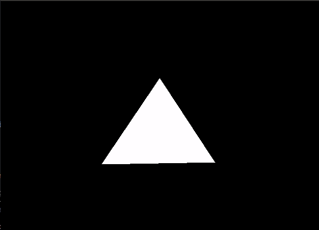

# Lab 4 - Matrix Transformations (Applied Software Rasterization)

> It's time to get moving--using the power of matrices and vectors.

**Lab materials must be pushed to your repository one week from now before the next class begins**

**Read:** *Labs are designed to be finished in class if you work diligently, but expected to take 1-2 hours outside of class. They are often more 'tutorial' in style, and sometimes the solution may even be provided in pieces for you to type in and experiment. Copying & Pasting is discouraged however--make mistakes, play, and you will further learn the material.*

## Modify this section

- How many hours did it take you to complete this lab?
- Did you collaborate with any other students/TAs/Professors?
- Did you use any external resources? (Cite them below)
  - tbd
  - tbd
- (Optional) What was your favorite part of the lab?
- (Optional) How would you improve the lab?

## Logistics

You will be working with some starter code provided. You will be working in the ''BasicWidget.cpp'' and ''Matrix4f.h'' files for this assignment to create a spinning triangle.

## Description

The purpose of this lab is to implement and practice using transformations to manipulate a triangle!

## Part 1 - Why Matrices [Reading/Watching - 10 to 30 minutes]

Read Sections 1-3: [MATRICES IN COMPUTER GRAPHICS](./tj_12_2018_2_120_123.pdf)

I have found Chapters 3-5 of this video series very beneficial for visualizing what you will be doing with matrix transformations: https://www.youtube.com/watch?v=kYB8IZa5AuE&list=PL_w8oSr1JpVCZ5pKXHKz6PkjGCbPbSBYv&index=4

## Part 2 - Slide Deck

I found it helpful last lab to include a slidedeck. I will add to this as folks have questions to clear up any confusion.

Lab 4 Slidedeck: https://docs.google.com/presentation/d/1SC_lZk-35d84pY9DZ8fpsqhQZ7K0UxJzYHpSDHVR5IU/edit?usp=sharing

## Part 3 - The rotating triangle

Your task is to implement the following changes in the lab to get a spinning triangle.

#### Task 1 - Matrix4f 

In Matrix4f implement the following:
1. Transform(Vector4f b)
2. InitTranslation(float x, float y, float z)
3. InitRotation(float x, float y, float z)

#### Task 2 - BasicWidget.cpp

In lab.cpp, perform the following matrix multiplication to rotate the triangle in main.

1. ` transform = projection * translation * rotation `

Note: The function you have is 'Multiply' 
	- e.g. projection.Mulitply(translation)
		- This performs `projection * translation.`
	- Conceptually you are composing a new matrix by multiplying several matrices together, and setting the final coordinates of a vertex in 2D space (The third dimension is ignored in this lab for now).

## More Resources

Some additional resources to help you through this lab assignment

- [learncpp.com](https://www.learncpp.com/)
	  - Handy page for learning C++
- [cpluscplus.com](http://www.cplusplus.com/)
	  - Another handy page for learning C++. I particularly like the references as well, which show how to use much of the standard library.

## Assignment Strategy

My suggested strategy for this lab is:

- Complete Task 1 first. At a minimum, you need to complete 'Transform(...)' first before a triangle even shows up.

## How to run your program

Your solution should compile using the CMake build process.

## Deliverables

- Build and execute the **./lab** (or ./lab.exe if on windows) and be able to display a spinning triangle that has been translated back 3 units. 
 
## Going Further

What is that, you finished Early? Did you enjoy this lab? Here are some (optional) ways to further this assignment.

- Try creating multiple triangles and spinning them on different axes.

## Found a bug?

If you found a mistake (big or small, including spelling mistakes) in this lab, kindly send me an e-mail. It is not seen as nitpicky, but appreciated! (Or rather, future generations of students will appreciate it!)

- Fun fact: The famous computer scientist Donald Knuth would pay folks one $2.56 for errors in his published works. [[source](https://en.wikipedia.org/wiki/Knuth_reward_check)]
- Unfortunately, there is no monetary reward in this course :)

## F.A.Q

- Q: None so far!
	- A: Hurray! https://www.scratchapixel.com/ (Volume1) is probably a helpful resource.

## Even More Resources

- Matrix Related
	- [MIT News - Matrices Explained](http://news.mit.edu/2013/explained-matrices-1206)
