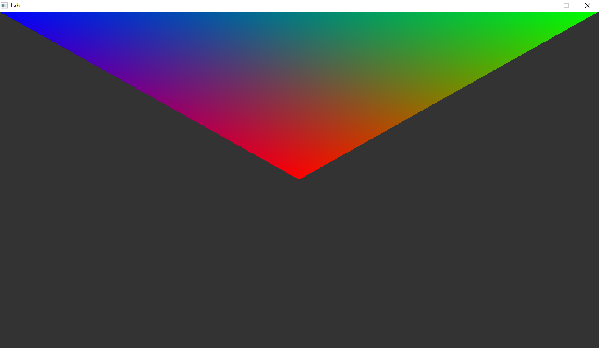

# Lab 6 - Color and Transform



> "Adding color into the world!"

**Lab materials must be pushed to your repository one week from now before the next class begins**

**Read:** *Labs are designed to be finished in class if you work diligently, but expected to take 1-2 hours outside of class. They are often more 'tutorial' in style, and sometimes the solution may even be provided in pieces for you to type in and experiment. Copying & Pasting is discouraged however--make mistakes, play, and you will further learn the material.*

## Modify this section

- How many hours did it take you to complete this lab?
- Did you collaborate with any other students/TAs/Professors?
- Did you use any external resources? (Cite them below)
  - tbd
  - tbd
- (Optional) What was your favorite part of the lab?
- (Optional) How would you improve the lab?

## Logistics

You will be working on your own laptop today.

## Description

Last lab we rendered a triangle and a square to the screen. As a recap:

1. We had to create an index buffer.
2. Populate that buffer with the correct indicies
3. Create and populate a buffer to define colors.
4. Then use glDrawElements to select which vertices to draw

Today we are going to work on two tasks:

1. Changing our buffer structure (1 buffer for vertex and color data)
2. Adding transformations


## Introduction

Adding color makes our scene less boring, but it also demonstrates how to add additional information to our buffers that we can use to control how objects are rendered.

For our second task, we are going to incorporate what we previously learned about transformations to create a perspective view of our scene.

## Task 1 - Color and glVertexAttribPointer

You will find in the code "TODO" sections in: BasicWidget.h/.cpp 

**The goal for this section is to render:**

1. A colored triangle using a single QOpenGLBuffer instead of 2 separate ones.

In order to do this we need to store more information in our model. Currently we have 'positional' data that stores where the vertices exist. We can additionally add 'color' data as another three-tuple. That is, we need to add 'R, G, B' data to our verts.

[glEnableVertexAttribArray](http://docs.gl/gl3/glEnableVertexAttribArray) and [glVertexAttribPointer](http://docs.gl/gl3/glVertexAttribPointer)

The first thing we need to do is enable a new attribute. Once we do that, then we need to tell how OpenGL should interpret that data. You can look at an example from your previous lab(or this current lab) of how this is done. The one trick is that you will have to play with the 'stride' and 'offset' (or starting point) of the data.

### Attributes quick glance

```c
 glEnableVertexAttribArray(0);  // Finally pass in our vertex data   
         glVertexAttribPointer(  0,   // Attribute 0, which will match layout in shader
                                 3,   // size (Number of components (2=x,y)  (3=x,y,z), etc.) 
                          GL_FLOAT, // Type of data
                          GL_FALSE, // Is the data normalized
                          sizeof(float)*6, // Stride - Amount of bytes between each vertex.
                          // If we only have vertex data, then this is 0.             
                          // That means our vertices(or whatever data) is tightly packed, 
                          // one after the other.    
                          // If we add in vertex color information(3 more floats), 
                          // then this becomes 6, as we move 6*sizeof(float) 
                          // to get to the next chunk of data.                    
                          // If we have normals, then we need to 
                          // jump 3*sizeof(GL_FLOAT) bytes to get
                          // to our next vertex.
                          0       // Pointer to the starting point of our data. 
                                  // If we are just grabbing vertices, this is 0. 
                                  // But if we have some other attribute, 
                                  // (stored in the same data structure), 
                                  // this may vary if the very first element
                                  // is some different attribute. 
                                  // If we had some data after (say normals), then 
                                  // we would have an offset 
                                  // of 3*sizeof(GL_FLOAT) for example
                            );       
```

**note:** The vertex shader and fragment shader have been done for you (In a few labs this will not be the case!). Read through the descriptions and ask yourself "why" does this work.

### Vertex Shader quick glance

```c
  // ==================================================================
  #version 330 core

  layout(location=0)in vec3 position; // We explicitly state which is the vertex information (The first 3 floats are positional data, we are putting in our vector)
  layout(location=1)in vec3 vertexColor; // Our second attribute which is the color.

  // Do not forget this!
  out vec3 theColor;

  void main()
  {
    // gl_Position is a special glsl variable that tells us what
    // postiion to put things in.
    // It takes in exactly 4 things.
    // Note that 'w' (the 4th dimension) should be 1.
    gl_Position = vec4(position.x, position.y, position.z, 1.0f);

    // Store the vertex color that we take in as what we will output
    // to the next stage in the graphics pipeline.
    theColor = vertexColor;

  }
  // ==================================================================

```

### Fragment Shader Quick Glance

```c
  // ==================================================================
  #version 330 core
  out vec4 color;

  in vec3 theColor;

  void main()
  {
   // color is a vec4 representing color. Because we are in a fragment
   // shader, we are expecting in our pipeline a color output.
   // That is essentially the job of the fragment shader!
    color = vec4(theColor, 1.0);
  }
  // ==================================================================
```

### Example Stride

The figure below shows how data is positioned, and different attributes are stored.


## Task 2 - Camera

Once you have a colored triangle, your goal is to be able render a
perspective camera. This means you will be using the glm library to
perform matrix (using mat4()) transformations. In order to figure out
how to get perspective, **I recommend reading** the following and
going through the "putting it all together" section on [Tutorial 3
matrices](http://www.opengl-tutorial.org/beginners-tutorials/tutorial-3-matrices/). You
will see how the uniform is setup (note, I have done this for you, but
in a slightly different way), and then how to use this in the shader
to ultimately get the final position of a vertex in perspective.


## Helpful Resources

- [docs.gl](http://docs.gl/) useful programming resource
- Start writing some OpenGL 3.3 from here! [learnopengl.com](https://learnopengl.com/) Use this time for graphics!

## Deliverables

1. A colored Triangle
2. A perspective camera

## Rubric

You (and any partner(s)) will receive the same grade from a scale of 0-2.

- 0 for no work completed by the deadline
- 1 for some work completed, but something is not working properly
- 2 for a completed lab (with possible 'going further' options completed)

## Going Further

What is that, you finished Early? Did you enjoy this lab? Here are some (optional) ways to further this assignment.

- Move your triangle with the arrow keys
- Try changing the colors of the triangle slowly over time.

## Found a bug?

If you found a mistake (big or small, including spelling mistakes) in this lab, kindly send me an e-mail. It is not seen as nitpicky, but appreciated! (Or rather, future generations of students will appreciate it!)

- Fun fact: The famous computer scientist Donald Knuth would pay folks one $2.56 for errors in his published works. [[source](https://en.wikipedia.org/wiki/Knuth_reward_check)]
- Unfortunately, there is no monetary reward in this course :)
